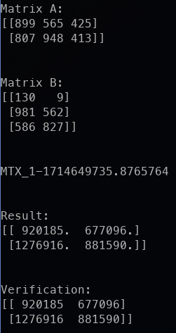

# Math II notes

Hey there! (Am I reading this again?), here you can find a set of different implementation with vectors, matrices and
some other mathematical cool things. Go around, catch you later!

## What can I find here?

Some images modification using math:

Matrix calculus

### Index

| Narrow                          | Folder                                                                     |
| ------------------------------- | -------------------------------------------------------------------------- |
| Images customization using math | [./task/vector_and_matrices/vectors/](./task/vector_and_matrices/vectors/) |
| Simple matricial calculus       | [./task/vector_and_matrices/matrix/ ](./task/vector_and_matrices/matrix/)  |

### How to help

#### Found a bug!?

Send a new issue [here](https://github.com/AndresMpa/math_II/issues/new?assignees=AndresMpa&labels=bug&projects=&template=community-bug-report.md&title=%5BBUG%5D)

#### Got an idea?

Tell me about that fancy idea in [here](https://github.com/AndresMpa/math_II/issues/new?assignees=AndresMpa&labels=enhancement&projects=&template=feature_request.md&title=%5BFEATURE%5D)
